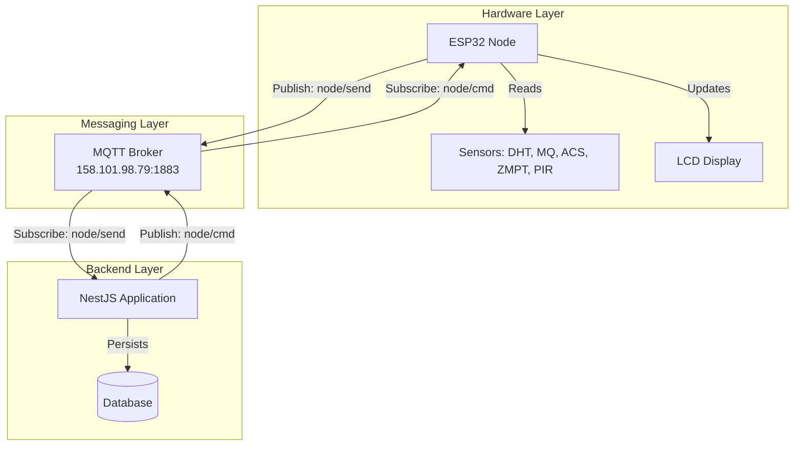
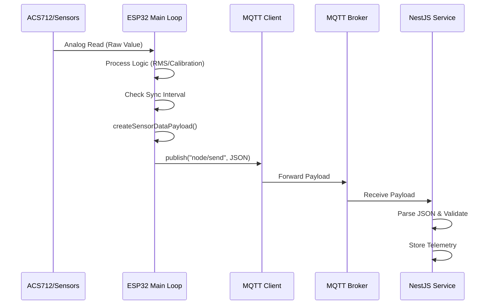
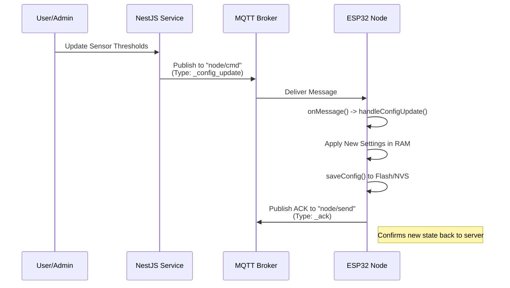

# Q-Home Automation System

## 1. Project Overview

**Q-Home** is a robust, modular Home Automation System designed to monitor environmental conditions and control appliances with real-time feedback. The system integrates an **ESP32-based hardware node** with a **NestJS backend** via an **MQTT Broker**, facilitating scalable, bidirectional communication.

### Technology Stack
*   **Hardware Firmware**: Arduino C++ (ESP32)
*   **Backend Architecture**: NestJS (Inferred) with Microservices Pattern
*   **Communication Protocol**: MQTT (Message Queuing Telemetry Transport)
*   **Broker Address**: `158.101.98.79:1883`
*   **Data Serialization**: JSON

### Core Purpose
The system provides:
1.  **Real-time Monitoring**: Temperature, Humidity, Air Quality (Gas), Light Levels, Voltage (ZMPT101B), and Current/Power (ACS712).
2.  **Automated Alerting**: Immediate notifications for threshold breaches (e.g., Gas Leak, High Voltage).
3.  **Remote Configuration**: Over-the-air updates for sensor thresholds and intervals without re-flashing firmware.
4.  **Actuation**: Remote control of appliances (e.g., Lighting).

---

## 2. Architecture Analysis

The system employs a **Microservices-oriented architecture** decoupled by an MQTT Broker. The ESP32 node acts as an intelligent edge device that not only streams telemetry but also manages local logic for critical safety alerts.

### Communication Flow
1.  **Telemetry Stream**: The ESP32 aggregates sensor readings and publishes a `_sensor_data` payload to the `node/send` topic at a defined `SYNC_INTERVAL`.
2.  **Command & Control**: The NestJS backend publishes configuration updates or commands (e.g., turn light on) to the `node/cmd` topic. The ESP32 subscribes to this topic upon connection.
3.  **Handshake**: On successful MQTT connection, the ESP32 publishes an `_ack` payload containing its full current configuration. This allows the backend to synchronize its state with the physical device.

---

## 3. System Flowcharts

### System Architecture Diagram
The high-level interaction between the Hardware Node, Broker, and Backend Services.



### Data Flow Diagram (Sensor to Cloud)
How a physical reading becomes a database record.



### Command Flow: Configuration Update
How the backend updates the device settings remotely.



---

## 4. API & MQTT Reference

### MQTT Topics
| Topic | Access | Description |
| :--- | :--- | :--- |
| `node/send` | **Publish** | Used by ESP32 to send Telemetry, Alerts, and ACKs. |
| `node/cmd` | **Subscribe** | Used by ESP32 to receive Commands and Configuration updates. |

### JSON Payload Structures

#### 1. Sensor Data Payload (`_sensor_data`)
Sent periodically to report environmental metrics.
```json
{
  "node_name": "Node1",
  "type": "_sensor_data",
  "data": {
    "temperature": "25.50",
    "humidity": "60.00",
    "mq_value": "120",
    "light_value": "850",
    "zmpt_value": "220.5",
    "acs_value": "0.45",
    "acs_power": "99.0"
  }
}
```

#### 2. Configuration Update & ACK Payload (`_config_update` / `_ack`)
Used for bidirectional syncing of device settings. The `_ack` payload uses this exact structure but with `type: "_ack"`.
```json
{
  "node_name": "Node1",
  "type": "_config_update", 
  "data": {
    "config": {
      "system": {
        "wifi_password": "new_password",
        "sync_interval": 5000
      },
      "sensors": {
        "dht_sensor": {
          "enabled": true,
          "high_temp_value": 40.0,
          "low_temp_value": 0.0,
          "read_interval": 2000
        },
        "pir_sensor": {
          "enabled": true,
          "read_interval": 1000
        },
        "mq_sensor": {
          "enabled": true,
          "detection_value": 300,
          "read_interval": 500
        },
        "light_sensor": {
          "enabled": true,
          "trigger_value": 500,
          "read_interval": 1000
        },
        "zmpt_sensor": {
          "enabled": true,
          "high_value": 250.0,
          "low_value": 180.0,
          "read_interval": 100
        },
        "acs_sensor": {
          "enabled": true,
          "high_value": 5.0,
          "read_interval": 100
        }
      }
    }
  }
}
```

#### 3. Alert / Error Payload (`_alert` / `_error`)
Sent immediately when a threshold is breached or hardware fails.
```json
{
  "node_name": "Node1",
  "type": "_alert", 
  "data": {
    "alert_type": "high_temperature", 
    "message": "Temperature exceeded 40.0C" 
  }
}
```

### Event Reference

#### Payload Types (`type`)
| Type | Direction | Description |
| :--- | :--- | :--- |
| `_ack` | Device -> Server | Verification of current state/config. |
| `_sensor_data` | Device -> Server | Periodic readings (Temp, Hum, Voltage, Current, etc). |
| `_config_update` | Server -> Device | New settings for sensors or system. |
| `_alert` | Device -> Server | Priority notification of a threshold breach. |
| `_command` | Server -> Device | Instruction to perform an action (e.g., toggle relay). |
| `_error` | Device -> Server | Hardware malfunction report. |

#### Alert Types (`alert_type`)
Used in `_alert` payloads to specify the event.
*   **Environment**: `high_temperature`, `low_temperature`
*   **Security**: `motion_detected`
*   **Safety**: `gas_detected`
*   **Power**: `high_voltage`, `low_voltage`, `high_current`
*   **State**: `light_on`, `light_off`

#### Error Types (`error_type`)
Used in `_error` payloads to identify faulty hardware.
*   `dht_read_failure`
*   `pir_read_failure`
*   `mq_read_failure`
*   `light_read_failure`
*   `zmpt_read_failure`
*   `acs_read_failure`

---

## 5. Module Breakdown (Backend Architecture)

Although the backend implementation is abstracted, the firmware structure implies the following NestJS Module responsibilities:

1.  **GatewayModule**:
    *   **Role**: Manages the MQTT connection pooling.
    *   **Responsibility**: Subscribes to `node/send`, routes incoming payloads based on `type` (`_sensor_data` vs `_alert`), and publishes commands to `node/cmd`.

2.  **DeviceDataModule**:
    *   **Role**: Telemetry persistence.
    *   **Responsibility**: Ingests `_sensor_data` payloads, timestamps them, and validates data integrity (e.g., ensuring voltage is within realistic bounds) before storing in the database.

3.  **ConfigModule**:
    *   **Role**: State Management.
    *   **Responsibility**: Stores the "Desired State" vs "Reported State". When a user changes a setting in the dashboard, this module generates the `_config_update` payload and listens for the subsequent `_ack` to confirm the device has applied changes.

4.  **SecurityModule (Alerts)**:
    *   **Role**: Critical Event Handling.
    *   **Responsibility**: Listens specifically for `_alert` type payloads. Triggers push notifications, emails, or SMS to the user immediately upon receipt of events like `gas_detected` or `high_voltage`.

---

## 6. Host Setup Guide

### Firmware Configuration
Before flashing the ESP32, verify the settings in `main/config.h`:

```cpp
// Default MQTT Server
#define DEFAULT_MQTT_SERVER_IP "158.101.98.79"
#define DEFAULT_MQTT_SERVER_PORT 1883
#define DEFAULT_MQTT_SERVER_USER "user123"
#define DEFAULT_MQTT_SERVER_PASS "pass123"
```
*   **IP Compliance**: Ensure the IP `158.101.98.79` is accessible from the network where the ESP32 is deployed.
*   **Credentials**: Update `DEFAULT_MQTT_SERVER_USER` and `PASS` if the broker requires authentication.

### Troubleshooting Connection
If the device fails to connect (`rc=-2` or similar):
1.  **Network Isolation**: Check if the ESP32 is on a Guest Network that blocks non-standard ports (1883).
2.  **Broker Availability**: Use a tool like **MQTT Explorer** on your PC to try connecting to `158.101.98.79:1883` with the same credentials.
3.  **Serial Debug**: Monitor the Serial output (Baud 115200).
    *   `[MQTT] Attempting connection... FAILED` indicates network reachability or credential issues.
    *   `deserializeJson() failed` indicates the backend is sending malformed JSON config updates.
